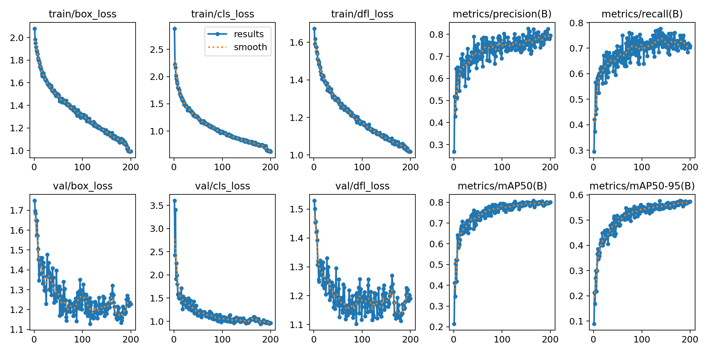
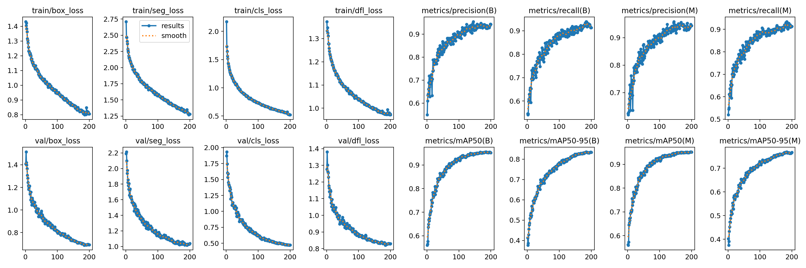
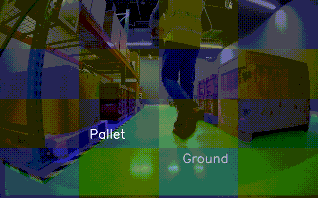
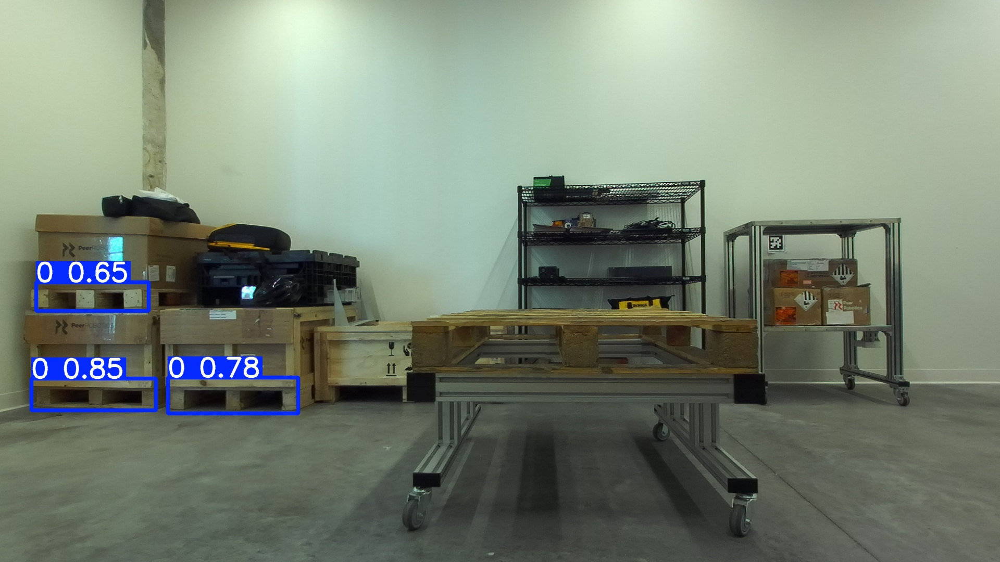
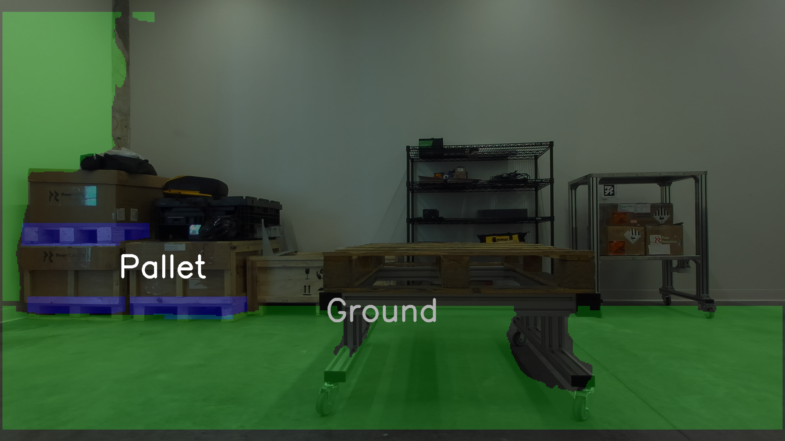

# Pallet & Ground Detection-Segmentation Application

## Objective
Solution for pallet detection and pallet-ground segmentation in a manufacturing or warehousing environment. The solution is optimized for real-time deployment on edge devices like the NVIDIA Jetson AGX Orin and is suitable for mobile robotics applications.

<table>
  <tr>
    <td>
      
    </td>
    <td>
      
    </td>
  </tr>
</table>

---

## Summary
### **1. Dataset Acquisition and Preparation**
- [x] **Dataset**: Used the recommended dataset (as per assignment).
- [x] **Annotation**: Initially used Grounded SAM (Grounding Dino + SAM), but switched to manual annotation for 100 images. Fine-tuned YOLOv11 to annotate the rest.
- [x] **Organization**: Organized in YOLOv11 format with train, validation, and test splits.
- [x] **Augmentation**: Applied techniques like flipping, rotation, Gaussian noise, blur, shear, grayscale, and saturation adjustments.

---

### **2. Object Detection and Semantic Segmentation**
- [x] **Object Detection Model**: Fine-tuned YOLOv11 for pallet detection.
- [x] **Semantic Segmentation Model**: Fine-tuned YOLOv11-seg for pallet-ground segmentation. 
- [x] **Training**: Trained using the recommended dataset. Trained using full (FP32) and half (FP16) precision.
- [x] **Performance Metrics**: Evaluated models using:
  - **mAP** for object detection.
  - **IoU** for semantic segmentation.
---

### **3. ROS 2 Node Development**
- [x] **ROS 2 Package**: Created a ROS 2 package compatible with Humble.
- [x] **Node Implementation**:
  - Subscribes to image and depth topics from a camera. 
  - Performs detection (pallets) and segmentation (pallet-ground).
  - Publishes detection and segmentation results.
  - Real-time inference and visualization using cv2. 
- [x] **Off-the-Shelf Usability**: Included a README to ensure nodes run without additional setup issues.

---

### **4. Edge Deployment Optimization (Optional)**
- [x] **Model Conversion**: Converted models to ONNX and TensorRT formats for optimized edge deployment. 
- [x] **Optimization Techniques**: Trained using Half precision, Applied quantization (INT8) for improved performance on the NVIDIA Jetson Orin.
- [ ] **Tested on Orin Nano**: Current unavailability of hardware. 
---

### **5. Dockerized Deployment**
- [X]  **Docker** : Docker File and installation instructions available for ease of usability.  
---

### **6. Evaluation Criteria**
- [x] **Live Camera Feed**: Full integration and testing with ros2 bags obtained from real warehouse [r2b dataset](https://catalog.ngc.nvidia.com/orgs/nvidia/teams/isaac/resources/r2bdataset2023) the ZED 2i camera feed provided in the assignment. 

- [x] **Detection Accuracy**: Initial testing performed; detection accuracy under varying conditions to be further evaluated.

---

---

## Table of Contents
1. [Dataset Preparation](#dataset-preparation)
2. [Model Development](#model-development)
3. [Results](#results)
3. [ROS 2 Node Development](#ros-2-node-development)
5. [How to Run](#environment-setup)
4. [Edge Deployment Optimization](#edge-deployment-optimization)

---

## Dataset Preparation

1. **Dataset Acquisition**:
   
   - Link for recommended dataset : [Pallets](https://drive.google.com/drive/folders/1xSqKa55QrNGufLRQZAbp0KFGYr9ecqgT)
    
2. **Data Annotation**:

   - Annotated Dataset Link (detection and segmentation): [Pallets-Annotated](https://drive.google.com/file/d/1MsLv1pdn9zk5YqzmE9aiHjZcGETamikd/view?usp=sharing)
   - For Training : store in the `dataset` folder in the package.

4. **Dataset Organization**:
   - Split into:
     - Training: 80%
     - Validation: 10%
     - Test: 10%

5. ROS2 Bags for real-world Deployment. 

    - Feed from RealSense D455 : [r2b_storage](https://catalog.ngc.nvidia.com/orgs/nvidia/teams/isaac/resources/r2bdataset2023)
    
    - Feed from zed 2i : [camera_data](https://drive.usercontent.google.com/download?id=1BvhP653G3PqfUq96L18gDBIi-5oOYqcr&export=download&authuser=0)
    
    - For real-time inference, store in the `rosbag` folder of the package. 

---

## Model Development

### Object Detection

- **Model**: YOLOv11 nano. 

- **Training Framework**: PyTorch (trained in FP32 and FP16 precision).

- **Losses, Mean Average Precision (MAP), Precision and Recall** 


  
- **Performance Metrics**:
  - For FP32 model: 
    - mAP50: 0.7929262822118579
    - mAP50-95: 0.5674033615455085
    - Precision: 0.81439
    - Recall: 0.70399
    - Inference Speed: 4.2 ms
  
  - For Optimized model (trained FP16, then Quantized to INT8): 

    - Inference Speed: 2.45 ms

  **Note**: These are evaluated on a 3080Ti Laptop GPU (TODO: Update Specs ). 

### Semantic Segmentation

- **Model**: YOLOv11 nano seg.

- **Training Framework**: PyTorch (trained in FP32 and FP16 precision).

- **Losses, Mean Average Precision (MAP), Precision and Recall**



- **Performance Metrics**:
  - mIoU (0.50-0.95): 0.7668
  - mIoU (0.50): 0.9546
  - Mean Precision: 0.9239
  - Mean Recall: 0.9240 

{TODO}
- **For Optimized Model** (Trained on FP32, then quantized to INT8)
  - Inference Speed: __ ms  

---
## Results

### Real World Deployment

- Feed from RealSense D455
  - Detection (Pallets)
  
- 

  - Segmentation (Pallets, Ground)
  
- 

- Inferences from Zed2i Camera. 

  - Detection (Pallets)
  
- 

  - Segmentation (Pallets, Ground)
  
- 
  

---

## ROS 2 Node Development

### ROS 2 Package

- Developed using ROS 2 Humble.

- Package Name: `peer_robotics_pallet_vision`

- Nodes:

  - `detector_node`:
    - Subscribes to camera image and depth topics.
    - Performs object detection on live camera feeds.
    - Publishes original images overlayed with predictions as visualization.

  - `segmentation_node`:
    - Subscribes to camera image topics.
    - Performs semantic segmentation on live camera feed. 
    - Publishes original images overlayed with segmentation masks. 

### Topics
- **Subscribed Topics**:
  
  - `/robot1/zed2i/left/image_rect_color` (sensor_msgs/Image)
  - `/camera/depth/image_raw` (sensor_msgs/Image)

- **Published Topics**:
  
  - '/segmentation_inference/overlay_image' (sensor_msgs/Image with bounding boxes)
  - '/detection_inference/overlay_image' (sensor_msgs/Image with segmented regions)

### Visualization

- Bounding boxes and segmentation masks are overlaid on the input image and then published. 

---

## Installation and Setup

### Prerequisites

#### Install ROS 2 Humble
Ensure you have **ROS 2 Humble** installed on **Ubuntu 22.04**. Follow the official ROS 2 documentation for installation:  
[ROS 2 Humble Installation Guide](https://docs.ros.org/en/humble/Installation.html)

---

#### Install Miniconda

Install **Miniconda** to manage the Python environment. Follow the official installation guide:  
[Miniconda Installation Guide](https://docs.conda.io/projects/conda/en/latest/user-guide/install/index.html)

---

### Environment Setup


#### **Step 1: Create a ROS 2 Workspace**

Create a ROS 2 workspace and navigate to the `src` directory:
```bash
mkdir -p <ros2_ws>/src && cd <ros2_ws>/src
```

#### Step 2: Clone the Repository

Clone the Peer Robotics Pallet Vision repository:

```bash
git clone https://github.com/rkulkarni1999/peer_robotics_pallet_vision.git
```
Navigate to the package directory:

```bash
cd peer_robotics_pallet_vision
```

#### Step 3: Set Up the Environment

Make the setup script executable:

```bash
chmod +x setup_env.sh
```

Run the setup script:

```bash
./setup_env.sh
```

Activate the `yolo_env` Conda environment:

```bash
conda activate yolo_env
```

#### Step 4: Build the Workspace

Navigate back to the ROS 2 workspace root:

```bash
cd <ros2_ws>
```

Source the ROS 2 workspace:

```bash
source install/setup.bash
```

#### Step 5: Configure Environment Variables

Set the `PYTHONPATH`, `PATH`, and `LD_LIBRARY_PATH` for the Conda environment:

```bash
export PYTHONPATH=$(python3 -c "import site; print(site.getsitepackages()[0])"):$PYTHONPATH
export PATH=$(python3 -c "import sys; print(':'.join(sys.path))"):$PATH
export LD_LIBRARY_PATH=$CONDA_PREFIX/lib:$LD_LIBRARY_PATH
```

#### Step 6: Navigate to the Package

Navigate to the package directory:

```bash
cd src/peer_robotics_pallet_vision/
```

### Usage

- First Run the rosbag for image data publishing. 

```bash
ros2 bag play rosbags/internship_assignment_sample_bag/ --loop
```
 
- In a different terminal: 

```bash
ros2 topic list
```

Based on this identity rgb and depth topics and then: 

- For Detection Node:

```bash
ros2 launch peer_robotics_pallet_vision pallet_detector.launch.py rgb_topic:=/d455_1_rgb_image depth_topic:=/d455_1_depth_image rosbag:=False
```

- For Segmentation Node:

```bash
ros2 launch peer_robotics_pallet_vision pallet_segmentor.launch.py rgb_topic:=/d455_1_rgb_image depth_topic:=/d455_1_depth_image rosbag:=False
```

- Alternatively, everything can be run using a single command after setting `rosbag:=True`

```bash
ros2 launch peer_robotics_pallet_vision pallet_segmentor.launch.py rgb_topic:=/d455_1_rgb_image depth_topic:=/d455_1_depth_image rosbag:=True
```

- Ensure that you have placed: 

```bash
yolo/models/final/detection/detection_final.pt
yolo/models/final/segmentation/segmentation_final.pt
```

These models are part of the repo. 


### Training Pipeline

1. Prepare dataset: 

  ```bash
  dataset/
  ├── train/
  │   ├── images/
  │   ├── labels/
  ├── val/
  │   ├── images/
  │   ├── labels/
  └── data.yaml
  ```

  Ensure right paths are set in 'data.yaml'


2. Both detection and segmenation models are trained in the same way :

  ```bash
  python train_yolo_detection.py --model_path yolo/models/yolo11n.pt --data_path ./datasets/detection_dataset/data.yaml --image_size 640 --batch_size 8 --epochs 200 --device 0 --save_period 50
  ```

3. To run inference : 

  ```bash
  python test_yolo_detection.py
  ```


## Edge Deployment Optimization

### Model Optimization

- Converted models to:

  - **ONNX**: For interoperability. 

  - **TensorRT**: For high-performance inference on AGX Orin. Note that implementation using TensorRT API is assumed out of scope for this assignment. 

  - Files for the above can be found in the `yolo/models/final/detection` and ``yolo/models/final/detection``:

- Applied:

  - **Quantization**: INT8 precision for reduced memory and faster inference.

  - **Pruning**: Not Applied because the model yolov11n and yolo11n-seg are already small. 

### Dockerized Deployment

#### **Step 1: Build the Docker Container**

Navigate to the `docker` directory:
```bash
cd docker
```

Build the Docker image:

```bash
docker build -t peer2_ws:latest .
```

#### Step 2: Run the Docker Container

Run the container with GPU support enabled (assuming that gpus are setup on the laptop):

```bash
docker run --rm -it --gpus all peer2_ws
```

#### Step 3: Running the ROS 2 Nodes

1. Setting Up the Workspace

```bash
cd ~/peer_ws

# Activate the Conda environment:

conda activate yolo

source install/setup.bash

cd src/peer_robotics_pallet_vision/
```

2. Running the Rosbag
```bash
ros2 bag play rosbags/internship_assignment_sample_bag --loop
```

3. Open a New Terminal

Start a new interactive terminal, then set up the environment:

```bash
conda activate yolo && cd peer_ws && source install/setup.bash && cd src/peer_robotics_pallet_vision/
```

4. Running the Detector Node

```bash
python peer_robotics_pallet_vision/nodes/pallet_detector.py
```

#### Step 4: Pruning the Container After Use
```bash
docker rm $(docker ps -aq)
docker rmi peer_ws
docker system prune -a
```
